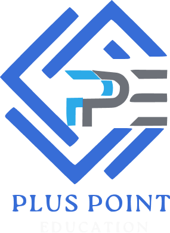

<p align="center"><a href="https://pluspoint.uk" target="_blank"></a></p>

<p align="center">
</p>

## 🏫 About PlusPoint

Plus Point Educational Support Services is an organization focused on guiding students through the complexities of international university admissions. This project was completed in one month as part of my internship as a Frontend Developer for a client. It provides comprehensive assistance in selecting the right institutions and courses while ensuring that students meet all necessary application requirements for studying abroad. The company specializes in admissions to countries such as the UK, Germany, Romania, Canada, Australia, New Zealand, Singapore, Malaysia, UAE, and India. PlusPoint is dedicated to helping students achieve their educational goals and successfully navigate the international application process. 

Visit [PlusPoint's website](https://pluspoint.uk).


## 📦 Technologies

The technologies used in this project include:

- **HTML5**: For structuring the web pages.
- **CSS3**: For styling the website and ensuring it’s visually appealing.
- **Bootstrap**: To create responsive designs and streamline the layout using prebuilt components and grid systems.
- **Laravel**: For managing backend logic, session handling, and database management.
- **MySQL**: As the database for storing student and university information.
- **JavaScript**: To add interactivity and dynamic features to the website.
- **MAMP**: For running the project in a local development environment.

## 🦄 Features

- **Responsive Design**: The website adapts to various screen sizes, ensuring a seamless experience across devices.
- **Dynamic Country List**: The website lists top abroad countries for education with filtering options based on user preferences.
- **Application Tracking**: Students can track their application status through a dedicated portal.
- **Admin Dashboard**: Admins can configure the application through a dedicated admin portal.
- **Dynamic Blogs Page**: The dynamic blogs page offers users a collection of engaging articles with easy navigation through categories and tags, readers can quickly find relevant content.
- **Contact Forms**: Easy-to-use forms for inquiries and feedback.
- **User Authentication**: A secure login and registration system for students to access personalized services.
- **Custom Email Notifications**: The application includes a feature that sends personalized emails to users, staff, and admins enabling tailored communication for announcements, updates, and reminders.

## 👩🏽‍🍳 The Process

The process of building this project involved the following steps:

- **Research & Planning**: Conducting comprehensive research to gather requirements from students and universities, which guided the development of a customized service platform tailored to user needs.
- **Wireframing**: Designing wireframes using tools like Figma to outline the website architecture, allowing for a structured approach to feature integration and user flow.
- **Frontend Development**: Utilizing HTML, CSS, and Bootstrap to construct a responsive user interface, ensuring cross-browser compatibility and optimal user experience across various devices.
- **Custom Logic Development**: Implementing custom controllers and dynamic features using Laravel's MVC architecture, enhancing the application's interactivity and improving data handling through advanced routing and middleware.
- **Backend Development**: Leveraging Laravel for server-side logic, including ORM for database interactions, authentication mechanisms, and session management, which ensured secure and efficient data processing.
- **Testing**: Conducting unit and integration tests to validate functionality, performance, and security across multiple devices and browsers, ensuring a robust and reliable application.
- **Deployment**: Deploying the application on a cloud-based hosting service, optimizing the environment for performance, scalability, and availability to the public.

## 📚 What I Learned

During this project, I gained valuable insights and skills, including:

- **Effective Use of Laravel**: Acquiring hands-on experience in leveraging Laravel’s powerful features, such as Eloquent ORM for seamless database interactions, routing for clean URL management, and middleware for enhanced security.
- **Responsive Web Design**: Mastering the creation of adaptive layouts using Bootstrap’s grid system, ensuring optimal user experience across a wide array of devices and screen sizes, from desktops to smartphones.
- **Database Management**: Designing and implementing a normalized database schema using MySQL to efficiently handle complex data relationships, ensuring data integrity and optimal performance for student and university records.
- **Project Management**: Developing strong organizational skills by employing agile methodologies to manage tasks, prioritize deadlines, and adapt to changing project requirements, which facilitated timely project completion.
- **Collaboration and Stakeholder Engagement**: Collaborating effectively with diverse stakeholders, including mentors and team members, to align project goals and expectations, utilizing tools like Git for version control and communication platforms for real-time updates.


## 📈 Overall Growth

This project has significantly contributed to my growth in several key areas:

- **Technical Skills**: Enhanced my proficiency in full-stack web development, mastering both frontend and backend technologies while gaining hands-on experience with modern frameworks like Laravel and Bootstrap.
- **Problem Solving**: Developed robust problem-solving abilities by diagnosing and troubleshooting issues, optimizing site functionality, and implementing effective solutions under tight deadlines.
- **Project Management**: Cultivated strong project management skills by efficiently overseeing multiple components, prioritizing tasks, and ensuring timely delivery through agile methodologies and regular progress tracking.
- **Communication**: Improved my communication skills through effective collaboration with mentors and stakeholders, utilizing tools such as Slack and GitHub for streamlined discussions and version control.

## 💭 How Can It Be Improved?

- **Enhance User Experience**: Incorporating interactive features such as live chat support and AI-driven recommendations tailored for students to improve engagement and user satisfaction.
- **Multilingual Support**: Implementing multilingual capabilities to cater to a diverse, global audience, ensuring accessibility for non-English speakers.
- **Analytics Dashboard**: Developing an advanced admin panel with real-time analytics to track user activity, application trends, and performance metrics for informed decision-making.
- **Performance Optimization**: Focusing on improving loading times by optimizing assets such as images, CSS, and JavaScript through techniques like minification and lazy loading.
- **Mobile-First Design**: Although the design is currently responsive, adopting a mobile-first design approach would further enhance usability and performance for smartphone users, ensuring an optimal experience on all devices.

## 🚦 Running the Project

To run the project locally, follow these steps:

1. **Clone the Repository**: Download the project files from the repository.
   ```bash
   git clone [git@github.com:afthab-anthas/PLUSPOINT-EDU.git]
2. **Set Up Environment**: Install MAMP (or XAMPP) for running the project locally.

3. **Install Dependencies**: Navigate to the project directory and install the required Laravel dependencies.
   ```bash
   composer install
   npm install
4. **Set Up Environment Variables**: Configure the `.env` file with your database credentials.
5. **Migrate Database**: Run migrations to set up the database schema.
    ```bash
    php artisan migrate
6. **Run the Server**: Use Laravel’s built-in server to run the project.
    ```bash
    php artisan serve

7.**Access the Website**: Open `http://localhost:8000` to view the project locally.


## 🍿 Live Website


## Disclaimer

This project was developed by me for Expert Recruitment Services. The code and content presented on this website are for educational purposes only and are not intended for unauthorized use or reproduction. Any attempts to replicate, modify, or misuse this code could result in legal consequences. By accessing this website, you agree to use the information responsibly and respect the rights of the company.

